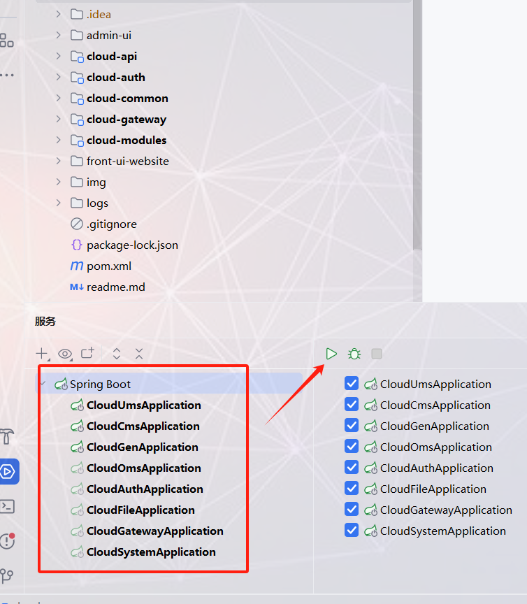

# 项目说明文档
## 一、项目启动方式
> 分三个步骤
### 1、nacos启动
进入我给你的nacos-2.0.2/bin目录下执行命令（用我给的nacos）：
> startup.cmd -m standalone
### 2、后端启动

> 按住Shift全选右边点击启动即可
### 3、前端启动
前端后台启动 
进入cloud/admin-ui输入命令：
> npm run dev

前台登录默认用户是jack/123321

前端前台启动
进入cloud/front-ui输入命令：
> npm run serve

后台管理员登录默认用户是admin/admin123
- 上述命令执行后显示绿色的和我图片上一样的绿色就无问题
- 上述前后台都可以在编辑器也可也外部cmd打开到相应路径执行命令

# mysql

118.196.16.103:13306 

MYSQL_USERNAME: food

MYSQL_PASSWORD: Food123..

# nacos

http://192.168.150.1:8848/nacos

用户名，密码：nacos,nacos

# Redis

118.196.16.103:6379

密码 123321

REDIS_DATABASE: 7

# rabbitmq

通过RabbitMQ发送的日志数据最终存储在系统模块(cloud-modules-system)的sys_oper_log数据库表中。

